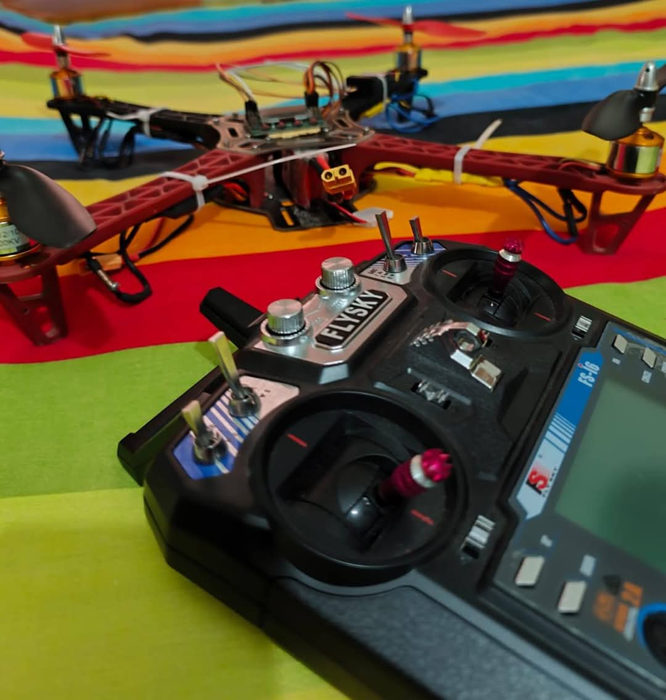

# DIY  Quadcopter Drone

This repository contains the build and setup information for my DIY quadcopter drone based on the F450 frame and KK2.1.5 flight controller.

## Components

- F450 Quadcopter Frame  
- Brushless Motors (4x)  
-30A ESC(4x)
- KK2.1.5 Flight Controller  
- Flysky FS-i6 Radio Transmitter and Receiver  
- 3 Cell LiPo Battery (11.1V)  
- Battery Strap  
- IMAX B6 AC LiPo Balance Charger  
- Zip Ties  

## Purpose

To build a stable quadcopter drone suitable for beginner to intermediate pilots, learning flight controller setup and calibration.

## Build Instructions

1. Assemble the F450 frame and mount the brushless motors.  
2. Connect ESCs to motors and KK2.1.5 flight controller.  
3. Connect Flysky FS-i6 receiver to flight controller.  
4. Secure battery with strap and connect to power distribution board.  
5. Bind Flysky FS-i6 transmitter and receiver.  
6. Calibrate KK2.1.5 flight controller according to the manual.  
7. Perform initial test flights and tune as necessary.

## Media

### Photos

  
*Drone assembled on F450 frame.*

  
*Close-up of the motor and wiring.*

## Drone Flight Video

[Watch the flight video here](./drone3.mp4)

## Troubleshooting

- Motors not spinning? Check motor direction and ESC calibration.  
- Propellers loosening? Use threadlocker or zip ties.  
- Radio transmitter not binding? Verify receiver wiring and battery voltage.

## License

This project is licensed under the MIT License.

---

Feel free to contribute improvements or ask questions!

